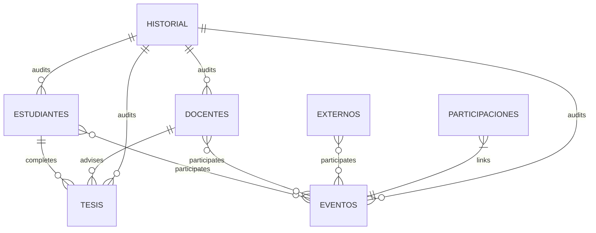

## Overview

SGD-MCS uses Google Sheets as its database, with each sheet (tab) representing a different entity table. The system supports students, faculty, thesis projects, events, institutions, and external participants.

<Info>
  The database uses a spreadsheet-based architecture with automatic ID generation and audit logging.
</Info>

## Database Connection

```javascript
const SPREADSHEET_ID = '13DnE1bamQgWQ2G5cuGq9vdlP-tHu6QgdBtZptqKkLuc';

function getDB() {
    return SpreadsheetApp.openById(SPREADSHEET_ID);
}
```

**Location:** Backend/core/config.js:11-62

## Entity Sheets

### Estudiantes (Students)

**Sheet Name:** `Estudiantes`  
**Color:** #4285F4 (Google Blue)  
**ID Prefix:** `EST`

<ParamField path="ID_Estudiante" type="string" required>
  Unique student identifier (e.g., EST0001)
</ParamField>

<ParamField path="Nombre1" type="string" required>
  First name (auto-normalized to Title Case)
</ParamField>

<ParamField path="Nombre2" type="string">
  Middle name (optional)
</ParamField>

<ParamField path="Apellido1" type="string" required>
  First last name
</ParamField>

<ParamField path="Apellido2" type="string">
  Second last name (optional)
</ParamField>

<ParamField path="Email" type="string" required>
  Student email (auto-converted to lowercase)
</ParamField>

<ParamField path="Estado" type="enum" default="Matriculado">
  Student status: `Matriculado`, `Egresado`, `Graduado`
</ParamField>

<ParamField path="Cohorte_Ingreso" type="string">
  Enrollment cohort (e.g., "2023-1" for 2023 semester 1)
</ParamField>

<ParamField path="ID_Carpeta_Drive" type="string">
  Google Drive folder ID for student documents
</ParamField>

<ParamField path="URL_Carpeta_Drive" type="string">
  Public URL to student's Drive folder
</ParamField>

<ParamField path="Fecha_Registro" type="datetime">
  Record creation timestamp (auto-generated)
</ParamField>

<ParamField path="Usuario_Registro" type="string">
  Email of user who created the record
</ParamField>

<ParamField path="Ultima_Actualizacion" type="datetime">
  Last modification timestamp
</ParamField>

<ParamField path="Ultimo_Usuario" type="string">
  Email of user who last modified the record
</ParamField>

### Docentes (Faculty)

**Sheet Name:** `Docentes`  
**Color:** #FF9800 (Orange)  
**ID Prefix:** `DOC`

Structure similar to Estudiantes with faculty-specific fields:

- `ID_Docente` - Faculty ID (e.g., DOC0001)
- `Nombre1`, `Nombre2`, `Apellido1`, `Apellido2` - Names
- `Email` - Faculty email
- `Especialidad` - Area of expertise
- `ID_Carpeta_Drive`, `URL_Carpeta_Drive` - Drive integration
- Audit fields (Fecha_Registro, Usuario_Registro, etc.)

### ParticipantesExternos (External Participants)

**Sheet Name:** `ParticipantesExternos`  
**Color:** #8BC34A (Light Green)  
**ID Prefix:** `EXT`

For external collaborators, industry experts, guest speakers:

- `ID_Externo` - External participant ID (e.g., EXT0001)
- Name and contact fields
- `Organizacion` - Organization/company
- `Pais` - Country
- Drive and audit fields

### Tesis (Thesis Projects)

**Sheet Name:** `Tesis`  
**Color:** #9C27B0 (Purple)  
**ID Prefix:** `TES`

<ParamField path="ID_Tesis" type="string" required>
  Unique thesis identifier (e.g., TES0001)
</ParamField>

<ParamField path="Titulo_Investigacion" type="string" required>
  Thesis title (auto-normalized to Sentence case)
</ParamField>

<ParamField path="ID_Estudiante" type="string" required>
  Foreign key to Estudiantes sheet
</ParamField>

<ParamField path="ID_Director" type="string">
  Foreign key to Docentes sheet (thesis advisor)
</ParamField>

<ParamField path="ID_Codirector" type="string">
  Foreign key to Docentes sheet (co-advisor, optional)
</ParamField>

<ParamField path="Estado_Tesis" type="enum" default="En Curso">
  Thesis status: `En Curso`, `Sustentada`, `Aprobada`
</ParamField>

<ParamField path="Año" type="number">
  Year of thesis work (used for folder organization)
</ParamField>

<ParamField path="ID_Carpeta_Drive" type="string">
  Drive folder for thesis documents
</ParamField>

Audit fields included.

### Eventos (Events)

**Sheet Name:** `Eventos`  
**Color:** #E91E63 (Pink)  
**ID Prefix:** `EVT`

<ParamField path="ID_Evento" type="string" required>
  Unique event identifier (e.g., EVT0001)
</ParamField>

<ParamField path="Nombre_Evento" type="string" required>
  Event name (auto-converted to UPPERCASE)
</ParamField>

<ParamField path="Tipo_Evento" type="enum">
  Event type: `Seminario`, `Taller`, `Conferencia`, `Defensa`, etc.
</ParamField>

<ParamField path="Fecha_Evento" type="date">
  Event date
</ParamField>

<ParamField path="ID_Carpeta_Drive" type="string">
  Drive folder for event documents (certificates, attendance, etc.)
</ParamField>

Audit fields included.

### Instituciones (Institutions)

**Sheet Name:** `Instituciones`  
**Color:** #009688 (Teal)  
**ID Prefix:** `INS`

Partner universities, research centers, and organizations:

- `ID_Institucion` - Institution ID
- `Nombre_Institucion` - Institution name
- `Pais` - Country
- `Tipo_Convenio` - Partnership type
- Contact information
- Drive and audit fields

## Relational Sheets

### Participaciones (Event Participations)

**Sheet Name:** `Participaciones`  
**Color:** #607D8B (Blue Grey)

Many-to-many relationship between entities and events:

<ParamField path="ID_Participacion" type="string" required>
  Unique participation record ID
</ParamField>

<ParamField path="ID_Evento" type="string" required>
  Foreign key to Eventos sheet
</ParamField>

<ParamField path="ID_Participante" type="string" required>
  Can reference ID_Estudiante, ID_Docente, or ID_Externo
</ParamField>

<ParamField path="Tipo_Participante" type="enum" required>
  Entity type: `estudiante`, `docente`, `externo`
</ParamField>

<ParamField path="Rol" type="string">
  Participation role: `Asistente`, `Ponente`, `Organizador`, etc.
</ParamField>

### Historial_Documentos (Document History)

**Sheet Name:** `Historial_Documentos`  
**Color:** #3F51B5 (Indigo)

Audit trail for all document and entity operations:

<ParamField path="UUID" type="string" required>
  Unique audit record identifier (auto-generated)
</ParamField>

<ParamField path="Tipo_Documento" type="string" required>
  Action type: `ENTITY_CREATE`, `ENTITY_UPDATE`, `UPLOAD_FILE`, `SYNC_FOLDER`, etc.
</ParamField>

<ParamField path="ID_Beneficiario" type="string">
  Entity ID affected by the action
</ParamField>

<ParamField path="Nombre_Beneficiario" type="string">
  Name of affected entity
</ParamField>

<ParamField path="Detalle_Origen" type="string">
  Context: `entity`, `file`, `folder`
</ParamField>

<ParamField path="Detalles_JSON" type="json">
  Additional action details in JSON format
</ParamField>

<ParamField path="Fecha_Emision" type="datetime" required>
  Timestamp of action
</ParamField>

<ParamField path="Usuario_Emisor" type="string" required>
  Email of user who performed the action
</ParamField>

**Location:** Backend/utils/Utils.js:96-128

## System Configuration Sheet

### Configuracion (System Config)

**Sheet Name:** `Configuracion`  
**Color:** #263238 (Dark Grey)

Stores ID counters and system settings:

| Column A | Column B | Column C | Column D |
|----------|----------|----------|----------|
| Counter Name | Current Value | Description | Last Updated |
| Siguiente_ID_Estudiante | 15 | Student counter | 2026-03-04 |
| Siguiente_ID_Docente | 8 | Faculty counter | 2026-03-01 |
| Siguiente_ID_Externo | 5 | External counter | 2026-02-28 |
| Siguiente_ID_Tesis | 12 | Thesis counter | 2026-03-03 |
| Siguiente_ID_Evento | 20 | Event counter | 2026-03-04 |

<Warning>
  Do not manually edit counter values unless you understand the implications. The system auto-increments these atomically.
</Warning>

## ID Generation System

Automatic ID generation uses the Configuration sheet:

```javascript
function generateUniqueId(prefix, counterName) {
    const ss = SpreadsheetApp.openById(SPREADSHEET_ID);
    const configSheet = ss.getSheetByName(SHEETS.CONFIG);
    const data = configSheet.getDataRange().getValues();

    // Find counter row
    for (let i = 1; i < data.length; i++) {
        if (data[i][0] === counterName) {
            const currentVal = parseInt(data[i][1]);
            const rowIndex = i + 1;
            
            // Increment atomically
            const newVal = currentVal + 1;
            configSheet.getRange(rowIndex, 2).setValue(newVal);
            configSheet.getRange(rowIndex, 4).setValue(new Date());
            
            // Format: EST0001, DOC0045, etc.
            return `${prefix}${newVal.toString().padStart(4, '0')}`;
        }
    }
    
    throw new Error(`Counter '${counterName}' not found`);
}
```

**Location:** Backend/utils/Utils.js:13-40

### Counter Mapping

| Entity Type | Prefix | Counter Name |
|-------------|--------|-------------|
| estudiante | EST | Siguiente_ID_Estudiante |
| docente | DOC | Siguiente_ID_Docente |
| externo | EXT | Siguiente_ID_Externo |
| tesis | TES | Siguiente_ID_Tesis |
| evento | EVT | Siguiente_ID_Evento |

## Data Normalization

The system automatically normalizes data before storage:

```javascript
function normalizeData(type, data) {
    // Trim all strings
    for (const key in data) {
        if (typeof data[key] === 'string') data[key] = data[key].trim();
    }

    // Entity-specific normalization
    switch (type) {
        case 'estudiante':
        case 'docente':
        case 'externo':
            if (data.Nombre1) data.Nombre1 = toTitleCase(data.Nombre1);
            if (data.Apellido1) data.Apellido1 = toTitleCase(data.Apellido1);
            if (data.Email) data.Email = data.Email.toLowerCase();
            break;

        case 'evento':
            if (data.Nombre_Evento) data.Nombre_Evento = data.Nombre_Evento.toUpperCase();
            break;

        case 'tesis':
            if (data.Titulo_Investigacion) {
                let t = data.Titulo_Investigacion;
                data.Titulo_Investigacion = t.charAt(0).toUpperCase() + t.slice(1);
            }
            break;
    }

    return data;
}
```

**Location:** Backend/utils/Utils.js:57-89

## Drive Integration

Each entity can have an associated Google Drive folder:

### Folder Structure

```
SGD_DATABASE_ROOT/
├── Estudiantes/
│   ├── 2023-1/
│   │   ├── EST0001 - Juan Perez/
│   │   └── EST0002 - Maria Garcia/
│   └── 2023-2/
│       └── EST0003 - Carlos Lopez/
├── Docentes/
│   └── 2026/
│       └── DOC0001 - Dr. Ana Martinez/
├── Tesis/
│   ├── 2024/
│   │   └── TES0001 - Machine Learning Study/
│   └── 2025/
│       └── TES0002 - Education Platform/
└── Eventos/
    └── 2026/
        └── EVT0001 - SEMINARIO DE INVESTIGACION/
```

### Folder Creation

```javascript
function createEntityFolder(type, data) {
    const rootFolder = getSystemRootFolder();
    const typeFolderName = getSubfolderNameByType(type);
    const typeFolder = getOrCreateFolder(rootFolder, typeFolderName);
    
    // Organize by cohort/year
    let folderName = new Date().getFullYear().toString();
    
    if (type === 'estudiante' && data.Cohorte_Ingreso) {
        folderName = data.Cohorte_Ingreso; // e.g., "2023-1"
    }
    
    if (type === 'tesis' && data.Año) {
        folderName = data.Año.toString();
    }
    
    const yearFolder = getOrCreateFolder(typeFolder, folderName);
    
    // Entity folder name
    const id = data.ID_Estudiante || data.ID_Docente || data.ID_Tesis || data.ID_Evento;
    const label = data.Nombre1 ? `${data.Nombre1} ${data.Apellido1}` : 
                  (data.Titulo_Investigacion || data.Nombre_Evento);
    const entityName = `${id} - ${label}`.substring(0, 100);
    
    const finalFolder = getOrCreateFolder(yearFolder, entityName);
    
    return {
        id: finalFolder.getId(),
        url: finalFolder.getUrl()
    };
}
```

**Location:** Backend/services/DriveManager.js:73-130

## Entity Relationships



## CRUD Operations

All entity operations use the EntityManager:

### Create

```javascript
const result = createItem('estudiante', {
    Nombre1: 'Juan',
    Apellido1: 'Perez',
    Email: 'juan.perez@example.com',
    Estado: 'Matriculado',
    Cohorte_Ingreso: '2023-1'
});
```

**Location:** Backend/core/EntityManager.js:9-76

### Update

```javascript
const result = updateItem('estudiante', 'EST0001', {
    Estado: 'Egresado'
});
```

**Location:** Backend/core/EntityManager.js:81-141

### Delete

```javascript
const result = deleteItem('estudiante', 'EST0001');
```

**Location:** Backend/core/EntityManager.js:146-177

<Warning>
  Deletion moves the Drive folder to trash but does not permanently delete it. Restore is possible from Google Drive trash within 30 days.
</Warning>

## Data Retrieval

Sheet data is converted to JSON arrays:

```javascript
function getSimpleData(sheet) {
    if (!sheet) return [];
    const data = sheet.getDataRange().getDisplayValues();
    if (data.length < 2) return [];

    const headers = data.shift();
    
    return data.map(row => {
        let obj = {};
        headers.forEach((h, i) => {
            if (h) obj[h] = row[i];
        });
        return obj;
    });
}
```

**Location:** Backend/utils/DataUtils.js:9-25

## Best Practices

<AccordionGroup>
  <Accordion title="Always Use Config Constants">
    Reference sheets using `SHEETS.ESTUDIANTES` instead of hardcoding `"Estudiantes"` to avoid typos and maintain consistency.
  </Accordion>
  
  <Accordion title="Never Skip Normalization">
    Always call `normalizeData()` before saving to ensure consistent formatting across the database.
  </Accordion>
  
  <Accordion title="Preserve Audit Fields">
    Let the system manage `Fecha_Registro`, `Usuario_Registro`, `Ultima_Actualizacion`, and `Ultimo_Usuario` automatically.
  </Accordion>
  
  <Accordion title="Validate Foreign Keys">
    When referencing IDs from other sheets (e.g., ID_Estudiante in Tesis), verify the record exists first.
  </Accordion>
</AccordionGroup>

## Next Steps

<CardGroup cols={2}>
  <Card title="Configuration" icon="gear" href="/admin/configuration">
    Configure database connection and settings
  </Card>
  
  <Card title="Permissions" icon="lock" href="/admin/permissions">
    Set up user roles and access control
  </Card>
</CardGroup>